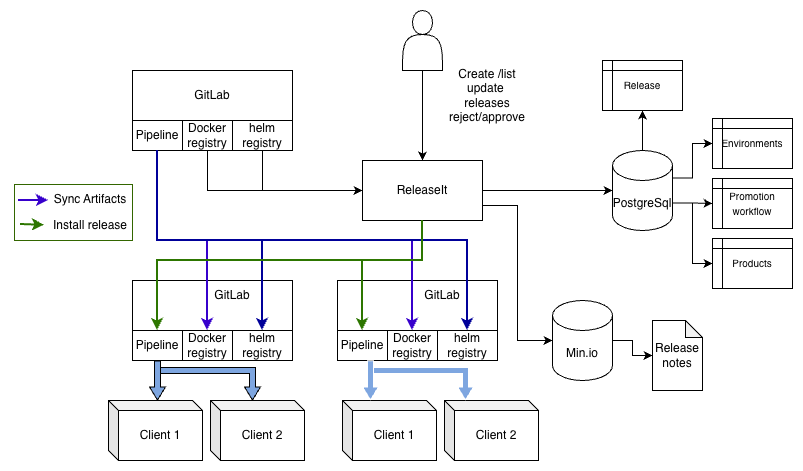

# Release it

## Overview

Aim of the project is to provide a structured support fo the release.

The workflow starts when the Development team release a new version of the product carrying a set of features was asked to implement.

A typical workflow, then, looks like the following:

- Development team complete a feature/set of feature to be released.
  - all code changes are in the main branch, they generated new stable version of the product that is ready to be shipped to QA.
  - The development team leader  select the product meant to be released and create a new version
  - the system, if configured, interact with the ticketing system (Jira) using standard query to retrieve all stories and bugs in the new release
  - process all the tasks and, using an embedded LLM system, generates a draft of the release note and allow the dev team lead to download it.
  - the dev team leads review the release note, upload the final version and promote the release for QA
- QA manager got engaged, execute the test plan in a test/staging environment,  report bugs to the development team, that cycle by releasing a new patch version  until all blocking issues are solved.
In the meanwhile:
  - Release management team (usually part of the product team) follow the approval process and start collecting all new candidate version of the different products to be released together as single bundle
  - Operation at the same time, plans the actions required for the new release to be installed. This involve execution of pipelines and, sometimes manual steps. Operation configure the required action in two checklist (pre and post installation checks).
- Once QA approves the release all artifacts for the different teams (release management, Operation, QA ) should be completed.
- The operation team start planning the client's installation. Each of them requires all pre and post installation checks to be executed. Operation might also report, during the installation, problems occurred and add checks for the following installation

ReleaseIT provides a unified interface to manage everything in the same place. Integrates third party system to execute 

Release It main goal is to provide a unified interface where developers, release manager, Quality Assurance and Operations are able to work and keep track of their process in a single place.

Release It roles:

- Developer
- Release Manager
- QA manager
- Administrator

## Release Management

The release promotion mechanism.
this includes:

- management of all artifacts linked to a specific release (version, short description, release note , changelog...)
- management of the release acceptance workflow with their statuses
- ability to trigger the installation on all environments
- manage the pre and post installation checklist with all manual activity required for the release to be activated.



## Entities

### Product

A product is the component a specific development team takes is responsible for.
Usually a product support a consistent set of related business capabilities.
A product as a Name and a list of Releases.

### Release

Release identify a specific version of the products/solution.
Each release has a specific `state` a Version (SemVer), a list of artifacts and a list of pre and post installation checks.

### Release State

Release state is a configured as an Acyclic Graph with nodes and transitions.
Each Node has a name and list of transitions
A Release state might be a non-final state or a final state.
A transition has a name.
The Position in the configuration yaml, define the score of the State.
Here an example in *yaml* format:

```yaml
State:
  - name: Draft
    transitions:
    - name: Ready
      state: 'In QA' 
    - name: Cancel
      state: Cancelled
  - name: 'In QA' 
    transitions:
    - name: 'Approve'
      state: 'Approved'
    - name:  Reject
      state: Rejected 
  - name:  Cancelled
  - name: Rejected
  - name: Approved
```

In the example above statuses are ordered as follows:
`Draft < 'In QA' < Cancelled < Rejected < Approved`

### Solution

A solution is a container that contains products. 
A solution has its own Version (SemVer) a list of linked artifacts.
The Solution stat is always equal to state of the product behind in the approval process 
Example:
product 1 with state 'Draft', product 2 with state 'In QA' -> product state 'Draft'
product 1 with state 'Approved', product 2 with state 'Rejected' -> product state 'Rejected'

The product pre and post installation checks are the union of the checks expressed in all products.

The solution management is optional. The Administrator can disable the solution feature by setting the environment variable `SOLUTION_ENABLED=false`

### Check

A check is a simple label that express an action needed before of after the installation.

### Audit

The Audit table stores all actions performed in the entities Solution, Product and release. 
Each action is stored with is name (example status update), original and new value refecence to the entitiy, operator (for manual actions) and timestamp.

### Release statuses

- *Draft*: the release bundle is not completed in all its parts yet. In this phase 
- *Created*: a new release has been created. All artifacts are added to the release with the list of products part of the new release and their version.
- *In QA*: external QA team is working on the release approval
- *Rejected*: if any problem the release might be rejected by providing the list of bugs and failed tests
- *Approved*: the release has been approved and ready to be released in the client environment. The system automatically run the pipeline to sync the production git (reg.git.local and d.git.local).

#### Release inheritance

If a release got rejected, the system allow the operator to create a new release that inherit all the assets of the previous one and fix the reported issues. This to avoid the needs of re-building a new release from scratch.

### Pipeline automatic execution (version 2)

Upon state change ReleaseIt supports the execution of a pipeline on one of the configured service. Standard integration is via HTTP rest api call with token authentication.
Supported system are:

- GitlabCI
- Ansible (via AWX)

## Implementation

- Backend: FastAPI/Python
- Frontend: React
- Data Storage: PostgreSQL (all application data, including files, should be stored in the database using the bytea type)
- add the following routes:
- /api/v1/product: for the product management
- /api/v1/release: for the release management
- /api/v1/environment: for the crud related to the environment
- /api/v1/user-management: user management (login, create/delete/update user, list/create/delete roles)