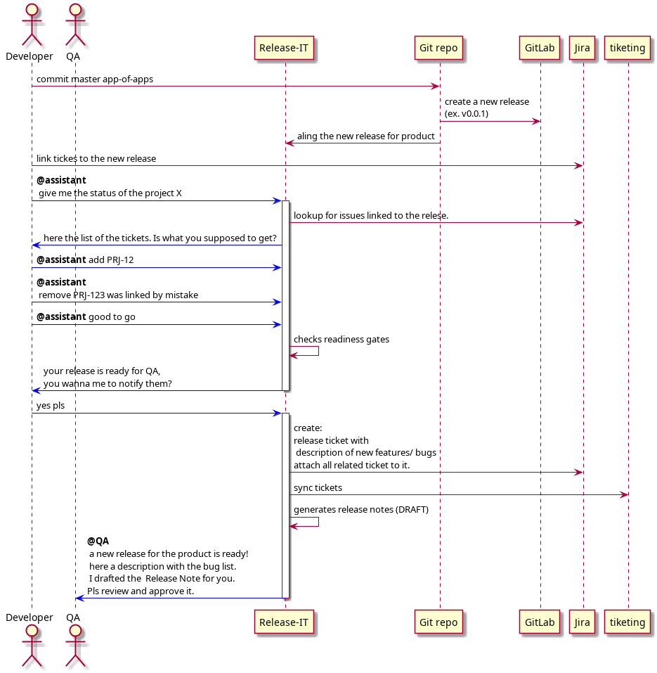
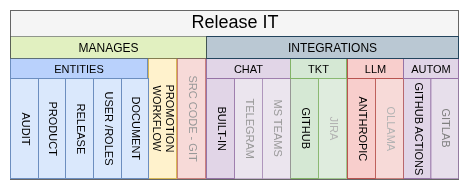

# Release-It

> **Status of this document:** describes Release-It as of version 0.0.1.
> Every capability below is tagged with its implementation status:
>
> | Tag | Meaning |
> |-----|---------|
> | **[Implemented]** | Built and exercised by tests. |
> | **[Partial]** | Built, but not yet validated: no test coverage, or never run against the real external service. |
> | **[Roadmap]** | Not built yet. |

## Overview

Release-It is a non-intrusive release management system, built to give real
support to teams that need to keep strong control over their project releases.

## Motivation

Release management is a complex task. It involves different teams (development,
product management, QA, operations, IT), each with its own skills, processes and
tools.

To avoid adding too much overhead, companies usually rely on a ticketing system
and a custom workflow. That choice gives easy access to basic information and a
minimal workflow, but it also comes with limitations. Both of the following
require non-trivial automation:

- adding readiness gates (checks on linked tickets, documentation, and so on);
- supporting the process with automation (repository synchronisation,
  environment updates).

This is especially true if you cannot rely on public cloud solutions.

Managing releases with a dedicated product is not a good answer either. Modern
software development is fragmented: to complete a single task, developers already
deal with a host of tools, such as ticketing, collaboration systems, document
management, source control and automation pipelines. Adding yet another tool does
not solve the problem and does not keep the team productive.

Release-It addresses these needs as a **non-intrusive companion**: it integrates
with the tools the company already uses instead of replacing them.

Release-It is built around the idea of a **conversational interface**. Users
interact with the system through the collaboration tool (chat) they already use.
The graphical web UI is mainly for administrators, who use it to monitor and
configure the application.

Here are some examples of the tasks Release-It can perform:

- model and enforce the company's standard release management workflow (steps,
  ownership, documentation, issue status). **[Implemented]**
- report on the current status of a release. **[Implemented]**
- manage tickets (list, create, label). **[Implemented]**
- draft documentation, such as changelogs and release notes. **[Implemented]**
- run automation pipelines, for example to verify that pipelines completed
  successfully, synchronise repositories and update environments. **[Partial]**
- keep an audit trail of every action. **[Implemented]**

## Example: a release from start to finish

The diagram below shows how a user may interact with Release-It.



### Upstream: the trigger (outside Release-It)

The release process starts in the systems the team already uses: source control,
CI and the issue tracker. **Release-It is not involved yet**, and does not manage
this part:

- the development team completes the workload agreed for the release, builds the
  new version of the product, and labels the tickets accordingly;
- an external system watches the repository, detects the new branch and creates
  the corresponding release ticket.

Release-It picks the release up from there, reading it from the issue tracker.

### The Release-It workflow

| # | Step                                     | Status |
|---|------------------------------------------|--------|
| 1 | The assistant helps developers finalise the content of the release: adding and removing linked tickets, and drafting the required documentation (for example the release note). | Implemented |
| 2 | Once the release is complete (all tickets linked, release note approved), development asks for the release to be handed over to QA. Release-It checks the readiness gates before allowing the transition. | Implemented |
| 3 | The system updates the state of the release and produces a release report. | Implemented |
| 4 | The system notifies QA that the release is ready. | Roadmap |
| 5 | QA asks Release-It to update one of the designated environments, according to the schedule. | Roadmap |
| 6 | The QA manager runs the test plan in a test or staging environment and reports bugs to the development team, which cycles by releasing a new patch version until all blocking issues are solved. | Implemented |
| 7 | Meanwhile, the release management team (usually part of the product team) is kept up to date on the status of the release. | Implemented |
| 8 | Meanwhile, operations gather information about the ongoing release. Release-It drafts the installation notes from the source repository, and works with operations to finalise them. | Roadmap |
| 9 | Once QA approves the release and all artifacts are approved, the system allows promotion to production. | Implemented |
| 10 | The operations team plans the installation for each client. Every installation requires a set of pre- and post-installation checks. Operations can also report problems encountered during an installation and add checks for the following ones. | Roadmap |

Steps 4, 5, 8 and 10 are not implemented today: Release-It has no notification
channel, no concept of a target environment, no source-code-management
integration, and no installation checklists. See
[Implementation status at a glance](#implementation-status-at-a-glance).

## Supported roles

Release-It ships with four roles: **Developer**, **Release Manager**,
**QA Manager** and **Administrator**. **[Implemented]**

Roles are enforced in two places: on the API as a whole, and per workflow
transition, since each transition declares which roles may perform it.
**[Implemented]**

## Components

The diagram below shows the components of Release-It. Greyed-out elements are not
implemented yet.



### Entities

#### Product

A product is the component a specific development team is responsible for. A
product usually implements a consistent set of related business capabilities. A
product has a name and a list of releases. **[Implemented]**

#### Release

A release identifies a specific version of a product. Each release has a state, a
version, and a list of artifacts attached to it. **[Implemented]**

#### Document

Release-It provides a versioned document management system. **[Implemented]**

Each document has a type, a version and a state.

- A document **state** is one of:
  - *Draft*: the document exists but has not been approved yet;
  - *Approved*: the document has been manually approved and is final.
- A document **type** is defined by:
  - a name;
  - a generation mode: manual, or automatic via AI;
  - a generation prompt, for automatically generated types.

Uploading a new version of a document returns it to the *Draft* state, so that a
change always has to be re-approved.

#### Audit

The audit log stores every action performed on a product or a release.
**[Implemented]**

Each audit entry records:

- **timestamp**: when the action happened;
- **step**: the name of the action;
- **change**: the value that changed;
- **by**: the actor who made the change.

### Release states

Release states are configurable (see
[Release promotion workflow](#release-promotion-workflow)). The workflow shipped
by default defines these states: **[Implemented]**

- *Draft*: the release bundle is not complete yet. It is still owned by the
  development team, which needs to finish setting it up (build, linked issues,
  documentation).
- *In QA*: the external QA team is working on approving the release.
- *Rejected*: the release has been rejected, with a list of the bugs and failed
  tests that caused the rejection.
- *Approved*: the release has been approved and is ready to be installed in the
  client environment.
- *Cancelled*: the release has been abandoned.

### Release promotion workflow

The release lifecycle is configured as a directed acyclic graph of states and
transitions. **[Implemented]**

- Each **state** has a name and a list of transitions. A state with no outgoing
  transition is a final state.
- Each **transition** has a name, a target state, the list of roles allowed to
  perform it, and a list of **readiness gates**.

**Readiness gates** are the conditions a release must satisfy for a transition to
be allowed. Two kinds of gate are available: **[Implemented]**

- `no_open_issues`: every issue linked to the release must be closed;
- `document:<Type>`: a document of the given type must be attached **and
  approved**. A document that is still in *Draft* does not satisfy the gate.

Release-It provides a dedicated interface to configure the workflow, and the
workflow can be exported as readable YAML for backup or review: **[Implemented]**

```yaml
State:
- name: Draft
  transitions:
  - name: Ready
    state: In QA
    requires:
    - document:Release Note
    - no_open_issues
  - name: Cancel
    state: Cancelled
- name: In QA
  transitions:
  - name: Approve
    state: Approved
  - name: Reject
    state: Rejected
- name: Cancelled
- name: Rejected
- name: Approved
```

In this example, a release can leave *Draft* only once every linked issue is
closed and an **approved** release note is attached.

## Integrations

### Chat

Chat is the main interface for regular users.

- Built-in chat: an agentic assistant that can query and act on releases. Every
  action it performs goes through the same role checks and readiness gates as the
  web UI. **[Implemented]**
- Microsoft Teams. **[Roadmap]**
- Telegram. **[Roadmap]**

### Ticketing system

Ticketing systems are Release-It's main source of information, and they own it:
Release-It keeps no copy of the tickets. A release stores the **search criteria**
that says which tickets belong to it — for example *all issues labelled v0.0.1* —
chosen when the release is created, with the matching tickets shown for
confirmation before it exists. Every question about a release's issues (the issue
list, the bug count, the `no_open_issues` readiness gate) resolves that criteria
against the ticketing system at the moment it is asked.

Nothing is cached, so nothing can be stale: a bug reopened a minute ago blocks the
release a minute later, not at the end of a polling interval. The price is that a
release's readiness cannot be shown, and a guarded transition cannot be taken,
while the ticketing system is unreachable — Release-It reports that rather than
answering from a copy, because "we could not check" and "there is nothing left to
fix" must never look the same.

An operator can ask about any single ticket (its key, summary, description, status
and a link to it in the tracker), and can **add a ticket to a release or remove
one** — from the Issues tab or by asking the assistant. Because membership is not
something Release-It records, adding a ticket means *editing the ticket until it
matches the release's criteria*: for a release whose criteria is *label = v0.0.1*,
adding a ticket puts the label `v0.0.1` on it, and removing one takes the label
off. The edit is made in the ticketing system, where the rest of the team sees it,
and is recorded in the release's history. A criteria with no such edit behind it —
an arbitrary JQL query — is refused with an explanation rather than guessed at:
there is no single change to a ticket that makes it match, and inventing one would
rewrite fields nobody asked about.

- GitHub Issues. **[Implemented]**
- Jira: implemented, but not yet validated against a real Jira instance.
  **[Partial]**

### LLM

The LLM is the *brain* Release-It is attached to. It powers the conversational
interface and the automatic generation of documents.

- Anthropic Claude. **[Implemented]**
- Ollama: implemented, but not yet validated. It is the intended option for
  on-premises AI. **[Partial]**

### Automation

Automation systems are the components Release-It integrates with to run CI/CD
pipelines.

- GitLab CI: a pipeline can be triggered when a release reaches *Approved*, but
  the integration has not been validated and is not yet exposed in the web UI.
  **[Partial]**
- GitHub Actions. **[Roadmap]**

### Source code management

Integrating with source code management is crucial for non-trivial technical
documentation, for example generating installation notes from the changes between
two versions.

Release-It is not integrated with any source code management system today, and has
no repository-parsing capability. **[Roadmap]**

## Architecture

Release-It is deployed as three services sharing a single database.
**[Implemented]**

| Component | Stack | Responsibility |
|-----------|-------|----------------|
| Backend | FastAPI, psycopg3, raw parametrized SQL, plain-SQL migrations | Domain model, workflow engine, readiness gates, assistant, integrations |
| Auth service | FastAPI, psycopg3, RS256 JWT + JWKS | Users, roles, token issuing, authorization policy |
| Frontend | React, TypeScript, Vite, served by nginx | Web UI, and the edge gateway in front of the backend |
| Database | PostgreSQL 16 | One instance and one database, with a dedicated schema and login role per service. Documents and artifacts are stored in-database. |

The services are packaged as Docker images with a Helm chart each, plus an
umbrella chart that brings up the whole stack in one release.

The backend runs no issue-synchronisation loop: a release's issues are read from
the ticketing system when they are asked for, so readiness gates and reports
always reflect the current state of the tracker with nothing in between to keep in
step.

## Security model

Authentication and static authorization happen at the **edge**, not in the
backend. Understanding this trust boundary is a prerequisite for deploying
Release-It safely. **[Implemented]**

- The auth service authenticates users and issues RS256 JWTs, published through a
  JWKS endpoint. It can be replaced by any OIDC/JWT provider (Keycloak, Auth0, and
  so on) through configuration.
- The nginx gateway authorizes every API call against the auth service (an
  `auth_request` subrequest), which evaluates a first-match-wins, default-deny
  authorization policy held in a YAML file. The policy can be changed without
  rebuilding the services.
- Once a call is authorized, the gateway injects the caller's identity downstream
  as the `X-Auth-Subject` and `X-Auth-Roles` headers.
- The backend **reads those headers and trusts them**. It performs no
  cryptographic verification of its own. It uses the roles only for the dynamic
  checks the static policy cannot express, such as the roles configured per
  workflow transition.

> **Deployment constraint.** Because the backend trusts the gateway's headers, it
> must never be reachable directly. Any client able to open a connection to the
> backend can set `X-Auth-Roles` itself and impersonate any role, administrator
> included. Keep the backend on an internal network (a ClusterIP service, not an
> ingress or a NodePort), and route all traffic through the gateway.

Secrets held in the runtime configuration (tracker tokens, LLM API keys) are
write-only through the configuration API: they are never returned to the UI.

## Implementation status at a glance

| Capability | Status |
|------------|--------|
| Products, releases and versioning | Implemented |
| Configurable workflow: state graph, transitions, role-gated | Implemented |
| Readiness gates (`no_open_issues`, approved `document:<Type>`) | Implemented |
| Workflow configuration UI and YAML export | Implemented |
| Versioned document management, Draft/Approved states | Implemented |
| AI-generated documents (per-type generation prompt) | Implemented |
| Audit log | Implemented |
| Roles and RBAC (Developer, Release Manager, QA Manager, Administrator) | Implemented |
| Built-in conversational assistant | Implemented |
| Web UI: dashboard, product and release management, configuration | Implemented |
| Issue tracker: GitHub Issues | Implemented |
| LLM: Anthropic Claude | Implemented |
| Issue tracker: Jira | Partial |
| LLM: Ollama (on-premises) | Partial |
| Pipelines: GitLab CI | Partial |
| Chat: Microsoft Teams, Telegram | Roadmap |
| Pipelines: GitHub Actions | Roadmap |
| Source code management integration | Roadmap |
| Environment management and updates | Roadmap |
| Notifications | Roadmap |
| Installation checklists (pre/post-installation checks) | Roadmap |
